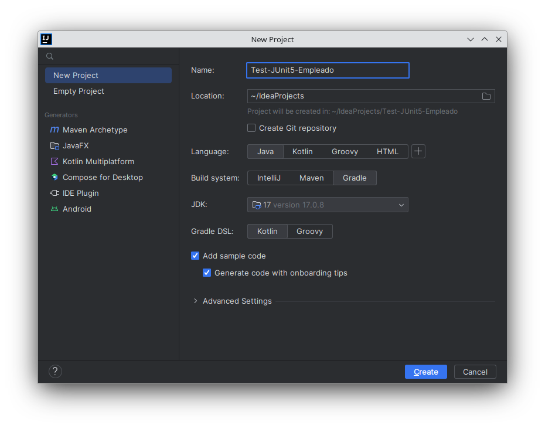
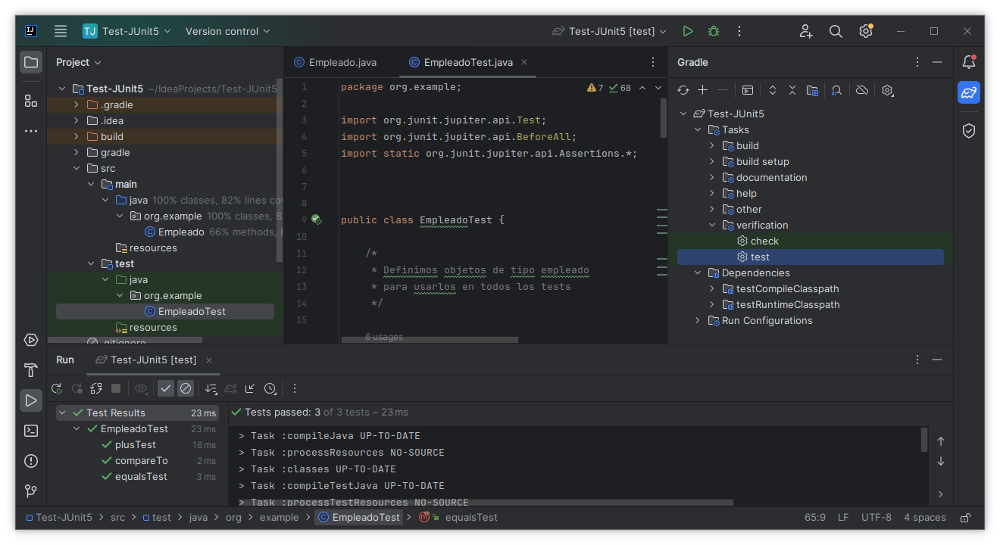
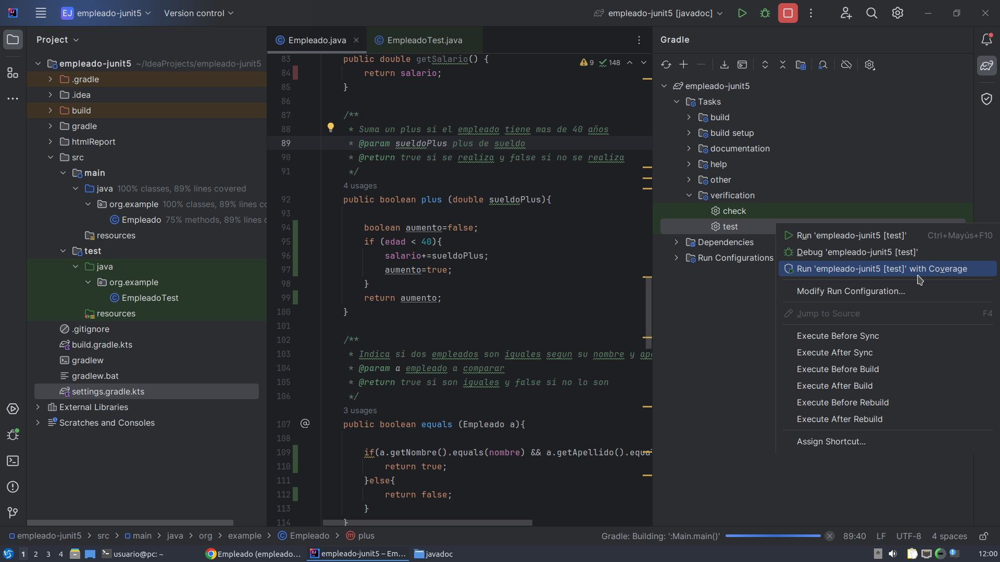
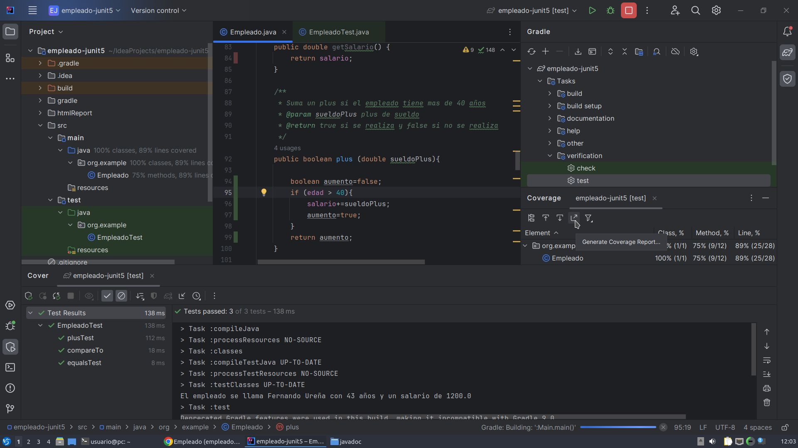
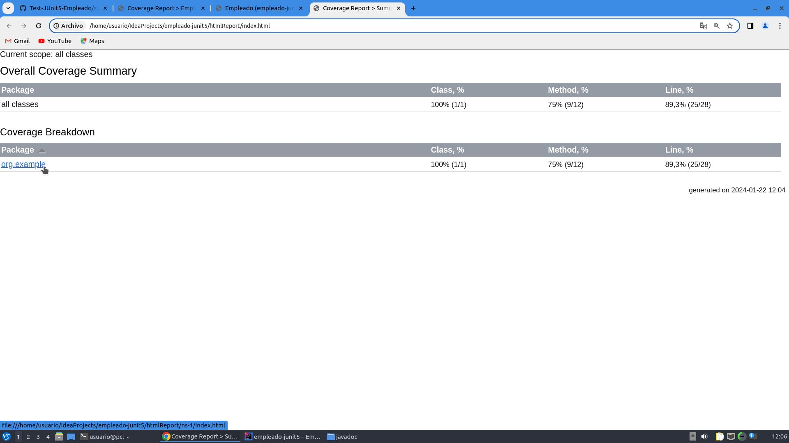
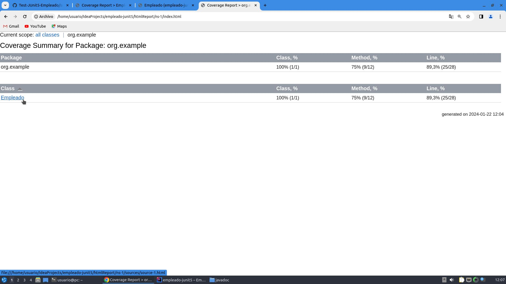
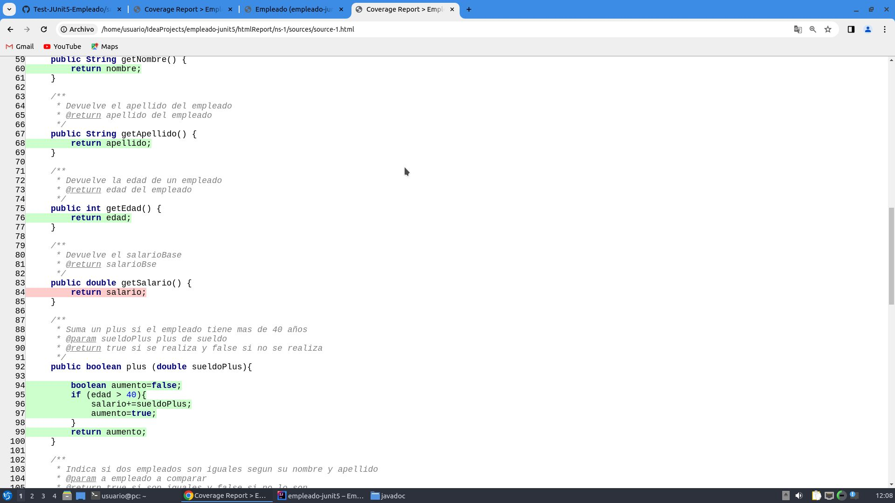

# Índice

#### [Introducción](#introduccion)
#### [Pruebas](#pruebas)
#### [Integración](#integracion)
#### [Calidad](#calidad)

<pre>
</pre>

<pre>
</pre>

# [Introducción](#indice)

1. Según tú, ¿a qué crees que nos referimos cuando hablamos de pruebas del software?

2. Según tú, ¿qué finalidad crees que se persigue cuando se hacen pruebas de software?

3. Según tú, ¿qué tipos de pruebas de software crees que existen?

4. Busca una definición del término Framework. Expresa dicha definición con tus palabras.

<pre>

</pre>

# [Pruebas](#indice)

1. ¿Qué diferencia existe entre las pruebas estáticas y dinámicas?

  Puedes consultar: https://es.wikipedia.org/wiki/Pruebas_de_software

2. ¿Qué diferencia existe entre las pruebas de caja negra y caja blanca?

  Puedes consultar: https://es.wikipedia.org/wiki/Pruebas_de_software

3. ¿Qué diferencia existe entre las pruebas funcionales y no funcionales?

  Puedes consultar: https://es.wikipedia.org/wiki/Pruebas_de_software

4. Nombra al menos 4 pruebas funcionales.

5. Nombra al menos 4 pruebas no funcionales.

6. ¿Qué són las pruebas unitarias o pruebas de unidad?

7. ¿Qué són las pruebas de regresión?

8. ¿Qué son las pruebas de integración?

9. ¿Qué son las pruebas de humo?

10. ¿Qué son las pruebas alpha?

11. ¿Qué son las pruebas beta?

12. ¿Qué son las pruebas de aceptación?

13. Instala el IDE IntelliJ IDEA Community Edition.
  Puedes encontrarlo en la [web oficial](https://www.jetbrains.com/idea/download/?section=linux)

14. La instalación de IntelliJ en Linux puede ser algo difícil. Desde [este enlace](https://drive.google.com/file/d/1sRutc8hzBQ3AWX31y_7d1oz48FDcRP-9/view?pli=1) puedes descargar un archivo .ova para VirtualBox con todo lo necesario: IntelliJ IDEA sobre LUbuntu.

15. Crea en Intellij IDEA un proyecto nuevo que utilice el sistema de construcción `Gradle` y  que contenga la clase _`Empleado`_. 

  Aquí tienes el [código fuente](https://github.com/jamj2000/Test-JUnit5-Empleado/blob/main/src/main/java/org/example/Empleado.java)

16. Edita la clase de prueba _`EmpleadoTest`_. 

  Aquí tienes el [código fuente](https://github.com/jamj2000/Test-JUnit5-Empleado/blob/main/src/test/java/org/example/EmpleadoTest.java)

  > NOTA: En JUnit, el método con anotación _`@BeforeAll`_ debe ser estático y, por tanto, las variables y objetos de los que haga uso también deben serlo.

  > NOTA: El código fuente anterior está basado en el tutorial disponible en [Disco duro de roer](https://www.discoduroderoer.es/como-hacer-una-aplicacion-de-prueba-con-junit). El código original funciona con JUnit4. Ha sido modificado para hacer uso de JUnit5. 

17. Busca la tarea de Gradle para realizar los tests y ejecútalos. Puedes acceder a ellos en `View` -> `Tools Windows` -> `Gradle`. También puedes acceder pulsando en el icono del elefante que tienes en la parte derecha superior.
 

  > NOTA: Existen muchas otras tareas que pueden realizarse en Gradle. Sin embargo, la tarea `run` fallará puesto que no existe método `main`.

18. A continuación vamos a trabajar la **cobertura de código** de los tests.
Antes de iniciar, consulta la documentación disponible en https://www.jetbrains.com/help/idea/code-coverage.html

19. Para visualizar la cobertura de código sigue los pasos indicados en las capturas. A continuación se muestra el proceso completo.

 

 

 

 

 

 

20.  Clona el repositorio https://github.com/jamj2000/Test-JUnit5-Aritmetica en tu equipo local.

 
21.  Busca la tarea de Gradle para realizar los tests y ejecútalos. Puedes acceder pulsando en el icono del elefante que tienes en la parte derecha superior.

22.  A continuación vamos a trabajar la **cobertura de código** de los tests. Puedes acceder en el icono justo debajo del elefante que tienes en la parte derecha superior. Luego pulsa en el icono 'Generate Coverage Report..."

23. Quita algunos casos de prueba y métodos de prueba y vuelve a comprobar la cobertura de código.

24.  ¿Qué necesitamos hacer en la clase `Utilidades.java` para solucionar los errores que aparecen y superar los tests?

<pre>

</pre>

# [Integración](#indice)

1. ¿Qué se entiende por Integración Continua?. Puedes consultar en https://es.wikipedia.org/wiki/Integraci%C3%B3n_continua

2. ¿Indica al menos 3 servicios web de Integración Continua?

3. Haz un resumen de las características de los siguientes sistemas de integración continua:
   - Jenkins
   - Bamboo
   - Travis CI
   - Circle CI
   Puedes consultar en https://www.ionos.es/digitalguide/paginas-web/desarrollo-web/herramientas-de-integracion-continua/

<pre>

</pre>

# [Calidad](#indice)

1. ¿Qué significan las siglas QA y QC? ¿Qué diferencia existe entre ellas?

2. Explica brevemente cada uno de los factores de calidad que aparecen en las diapositivas.

<pre>

</pre>
