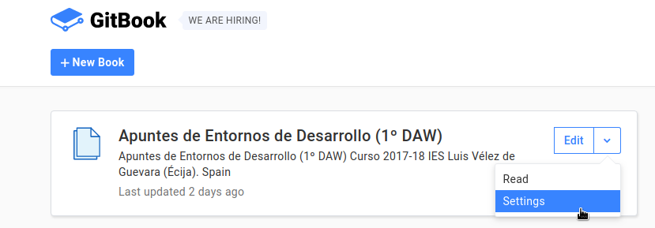
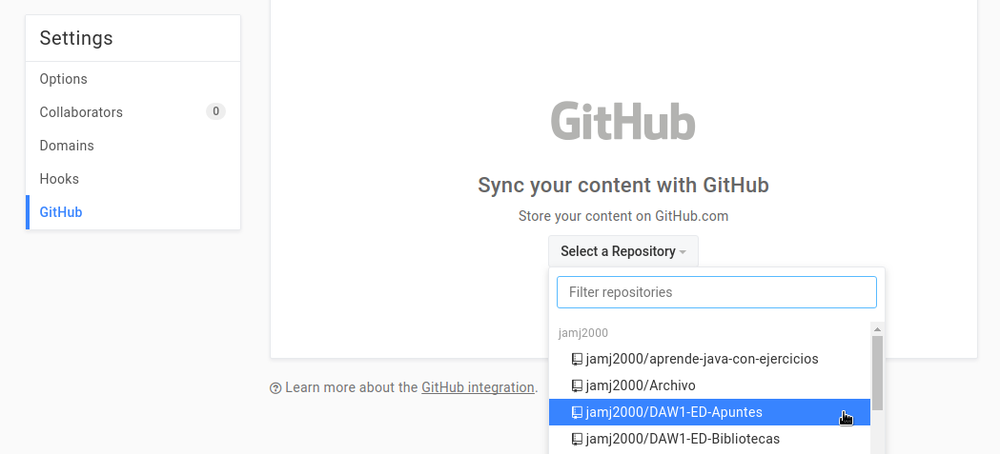
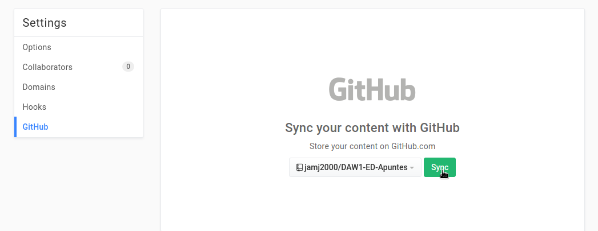
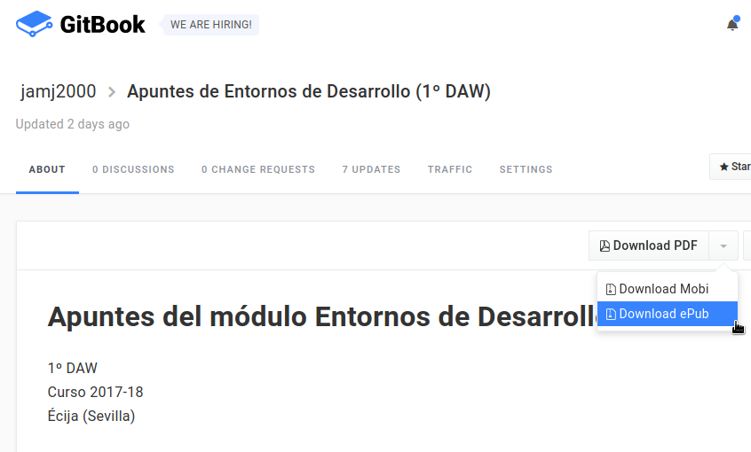

# Índice

#### [Introducción](#introduccion)
#### [Optimización](#optimizacion)
#### [Documentación](#documentacion)
#### [Control de versiones](#control-versiones)

<pre>
</pre>


<pre>
</pre>

# [Introducción](#indice)

1. Si un código fuente ha sido verificado (funciona correctamente) y validado (hace lo especificado en los requisitos) habiendo superado todos las pruebas, ¿crees que es mejorable? ¿en qué sentido?
<hr>

2. ¿Recuerdas los tipos de modificaciones que pueden realizarse al código en la __fase de mantenimiento__? Indica qué tipos de mantenimiento existen.
<hr>


<pre>


</pre>


# [Optimización](#optimizacion)


1. ¿Qué se entiende por hediondez del código? Pon al menos 5 ejemplos.
<hr>

2. ¿Qué tipo de herramienta utilizamos para hacer análisis estático del código?
<hr>

3. ¿Qué sitios web nos permiten hacer análisis estático del código o __Continuous Inspection__?
<hr>

4. Instala en Netbeans el plugin **FindBugs**, si no lo tienes aún instalado.
<hr>

5. Realiza **análisis estático de código** para las clases del proyecto *miapp*. Consulta el siguiente enlace: [análisis estático con FindBugs](https://github.com/jamj2000/DAW1-ED-Pruebas-Ejemplo1#an%C3%A1lisis-est%C3%A1tico-de-c%C3%B3digo-con-findbugs-en-netbeans)
<hr>

6. Indica al menos un `code smell` relevante de cada clase. Explica cómo podría solucionarse.
<hr>

7. ¿Qué es la refactorización?
<hr>

8. ¿Qué técnicas se utilizan a menudo a la hora de refactorizar?
<hr>

<pre>


</pre>

# [Documentación](#documentacion)

1. Genera la documentación técnica de Javadoc para el codigo fuente de algún ejercicio Java que hayas realizado en clase.
<hr>

2. En tu repositorio "Apuntes-ED" de GitHub, crea un archivo `SUMMARY.md` con un contenido similar al siguiente:
   
  ```markdown
  # Summary

  * [Unidad 1: Elementos de desarrollo del software](1.ELEMENTOS.md)    
  * [Unidad 2: Entornos integrados de desarrollo](2.ENTORNOS.md)  
  * [Unidad 3: Diseño y realización de prueba](3.PRUEBAS.md)  
  * [Unidad 4: Documentación y optimización](4.DOCUMENTACION.md)  
  * [Unidad 5: Elaboración de diagramas de clases](5.DIAGRAMAS_CLASES.md)  
  * [Unidad 6: Elaboración de diagramas de comportamiento](6.DIAGRAMAS_COMPORTAMIENTO.md)    
  ```

  Esto nos servirá más adelante para generar la tabla de contenido de un futuro libro en GitBook.
<hr>

3. En tu repositorio "Apuntes-ED" de GitHub, crea otro archivo `book.json` con el siguiente contenido:

  ```json
  {
    "gitbook": "3.x.x",
    "plugins" : [
        "include-codeblock",
        "ace"
    ],
    "pluginsConfig": {
        "include-codeblock": {
           "template":"acefull",
           "unindent": true
        }
    }
  }
  ```
  Esto nos servirá más adelante para el coloreado de código fuente de un futuro libro en GitBook.

<hr>

4. Ahora vamos a generar un libro en distintos formatos (PDF, Mobi y ePub) para tus apuntes de ED. Para ello registrate en https://www.gitbook.com con tu cuenta de GitHub.
<hr>

5. Inicia sesión de GitBook y pulsa en "+New Book" y después en "Book & Manual". Rellena los campos de "Title" y "Description".
Finalmente pulsa en "Create Book".
<hr>

6. Pulsa en el logotipo que aparece en la parte superior izquierda para ir a la página principal de GitBook. Luego, en la sección referida al libro que has creado, pulsa en la flecha que aparece al lado de "Edit" y después en "Settings".

  
<hr>

7. Después pulsa en "GitHub" y "Select a Repository" y marca tu repositorio "Apuntes-ED" y finalmente "Sync".

  

  
<hr>

8. Para ver y descargar el resultado en distintos formatos (PDF, Mobi y ePub) vuelve a la página principal pinchando en el logotipo que aparece en la parte superior izquierda.
Y después pulsa en el título del libro.
<hr>

9. Verás un botón para descargar el libro en distintos formatos. Haz una descarga del libro en formato PDF.

  
<hr>

<pre>


</pre>


# [Control de versiones](#control-versiones)

1. Además de Git, ¿que otros sistemas de control de versiones existen?
<hr>

2. En Git, ¿qué tres áreas existen?
<hr>

3. Busca en Internet un buen tutorial de GIT y realízalo. ¿De qué tutorial se trata?
<hr>

4. Visualiza el siguiente video y responde a las cuestiones que aparecen más abajo.

  - https://www.youtube.com/watch?v=uR6G2v_WsRA
<hr>

5. En Git, ¿para qué sirve el comando `git config`? 
<hr>

6. En Git, ¿para qué sirve el comando `git init`? 
<hr>

7. En Git, ¿para qué sirve el comando `git clone`? 
<hr>

8. En Git, ¿para qué sirve el comando `git status`? 
<hr>

9. En Git, ¿para qué sirve el comando `git add`? 

  
<hr>

10. En Git, ¿para qué sirve el comando `git commit`? 

  
<hr>

11. En Git, ¿para qué sirve el comando `git log`? 
<hr>

12. En Git, ¿para qué sirve el comando `git reset HEAD nombrearchivo`? 

  
<hr>

13. En Git, ¿para qué sirve el comando `git checkout -- nombrearchivo`? 

  
<hr>

14. Visualiza el siguiente video y responde a las cuestiones que aparecen más abajo.

 - https://www.youtube.com/watch?v=FyAAIHHClqI
<hr>

15. En Git, ¿para qué sirve el comando `git branch`? 
<hr>

16. En Git, ¿para qué sirve el comando `git checkout`? 
<hr>

17. En Git, ¿para qué sirve el comando `git merge`? 
<hr>

18. En Git, explica cómo funciona la fusión (merge) de tipo fast-forward.
 
  
 
  
<hr>

19. En Git, explica cómo funciona la fusión (merge) de tipo 3-way.

  
  
  
<hr>
<pre>


</pre>
