# Índice

#### [Introducción](#introduccion)
#### [Optimización](#optimizacion)
#### [Documentación](#documentacion)
#### [Control de versiones](#control-versiones)

<pre>
</pre>

<pre>
</pre>

# [Introducción](#indice)

1. Si un código fuente ha sido verificado (funciona correctamente) y validado (hace lo especificado en los requisitos) habiendo superado todos las pruebas, ¿crees que es mejorable? ¿en qué sentido?

2. ¿Recuerdas los tipos de modificaciones que pueden realizarse al código en la __fase de mantenimiento__? Indica qué tipos de mantenimiento existen.

<pre>

</pre>

# [Optimización](#optimizacion)

1. ¿Qué se entiende por hediondez del código? Pon al menos 5 ejemplos.

2. ¿Qué tipo de herramienta podemos usar para hacer análisis estático del código?

3. ¿Qué sitios web nos permiten hacer análisis estático del código o __Continuous Inspection__?

4.  Si no lo tienes en tu PC, descarga el código fuente del proyecto [Test-JUnit5-Aritmetica](https://github.com/jamj2000/Test-JUnit5-Aritmetica) 

5. Realiza **análisis estático de código** para las clases del proyecto *miapp*. Consulta el siguiente enlace: [análisis estático con IntelliJ](https://github.com/jamj2000/Test-JUnit5-Aritmetica/blob/master/README.md#an%C3%A1lisis-est%C3%A1tico-de-c%C3%B3digo-en-intellij-idea)

6. Indica al menos un `code smell` relevante de cada clase. Explica cómo podría solucionarse.

7. ¿Qué es la refactorización de código? Explícalo con tus palabras.

8. ¿Qué técnicas se utilizan a menudo a la hora de refactorizar? Basándote en en [este resumen](https://github.com/jamj2000/refactorizacion), pon 4 ejemplos similares a los del resumen anteior.

<pre>

</pre>

# [Documentación](#documentacion)

1. Genera la documentación técnica de **Javadoc** para el codigo fuente del [proyecto Java de Empleado](https://github.com/jamj2000/Test-JUnit5-Empleado) que hayas realizado en clase.
   A continuación se muestran las capturas de pantalla del proceso seguido.

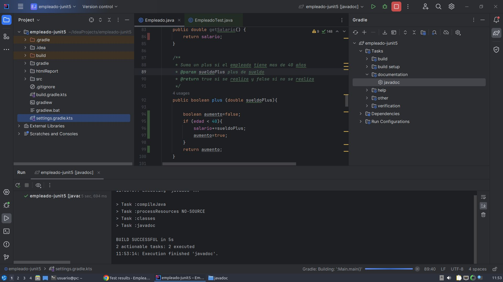

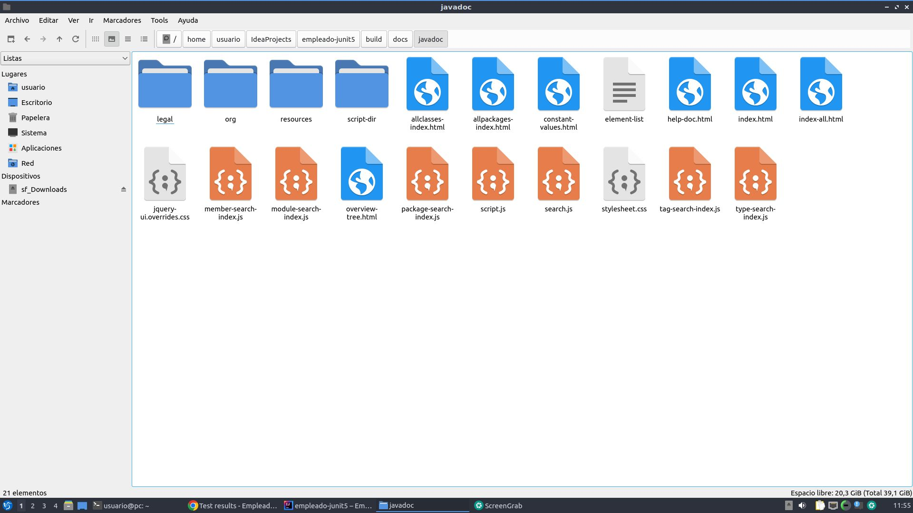

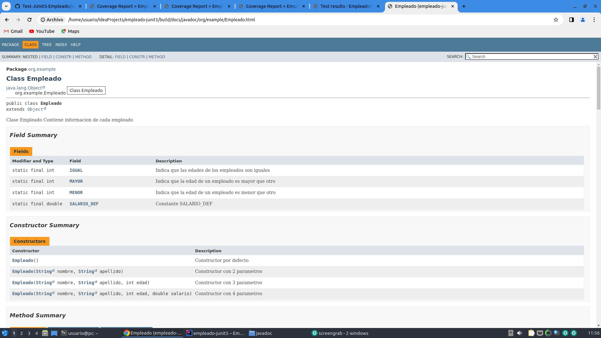

2. Genera la documentación técnica de **Javadoc** para el codigo fuente del [proyecto Java de Aritmética](https://github.com/jamj2000/Test-JUnit5-Aritmetica) que hayas realizado en clase.
 IMPORTANTE: Deberás añadir encima de la clase y de cada método los comentarios javadoc necesarios.

3. Markdown es un lenguaje para crear documentación muy usado en Github y muchos otros sitios. Consulta su sintaxis en [este enlace](https://www.markdownguide.org/basic-syntax/) y [este otro](https://docs.github.com/es/get-started/writing-on-github/getting-started-with-writing-and-formatting-on-github/basic-writing-and-formatting-syntax). Haciendo uso de estas guías, crea un repositorio en GitHub y elabora en Markdown unos apuntes personales del contenido del Tema 3. Indica cuál es el enlace del repositorio que has creado.

<pre>

</pre>

# [Control de versiones](#control-versiones)

1. Además de Git, ¿que otros sistemas de control de versiones existen?

2. En Git, ¿qué tres áreas existen?

3. Busca en Internet un buen tutorial de GIT y realízalo. ¿De qué tutorial se trata?

4. Visualiza el siguiente video y responde a las cuestiones que aparecen más abajo.

  - https://www.youtube.com/watch?v=uR6G2v_WsRA

5. En Git, ¿para qué sirve el comando `git config`? 

6. En Git, ¿para qué sirve el comando `git init`? 

7. En Git, ¿para qué sirve el comando `git clone`? 

8. En Git, ¿para qué sirve el comando `git status`? 

9. En Git, ¿para qué sirve el comando `git add`? 

  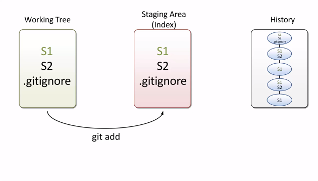

10. En Git, ¿para qué sirve el comando `git commit`? 

  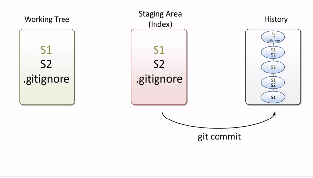

11. En Git, ¿para qué sirve el comando `git log`? 

12. En Git, ¿para qué sirve el comando `git reset HEAD nombrearchivo`? 

  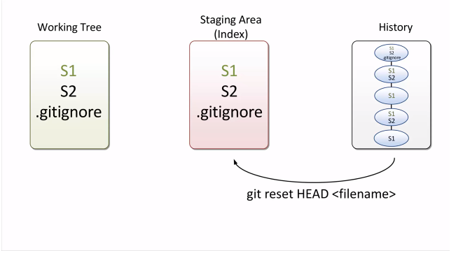

13. En Git, ¿para qué sirve el comando `git checkout -- nombrearchivo`? 

  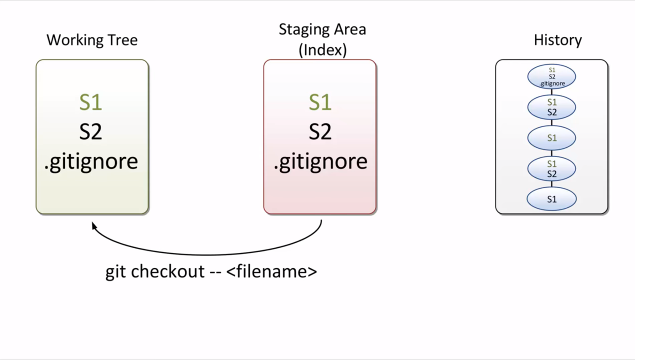

14. Visualiza el siguiente video y responde a las cuestiones que aparecen más abajo.

 - https://www.youtube.com/watch?v=FyAAIHHClqI

15. En Git, ¿para qué sirve el comando `git branch`? 

16. En Git, ¿para qué sirve el comando `git checkout`? 

17. En Git, ¿para qué sirve el comando `git merge`? 

18. En Git, explica cómo funciona la fusión (merge) de tipo fast-forward.
 
  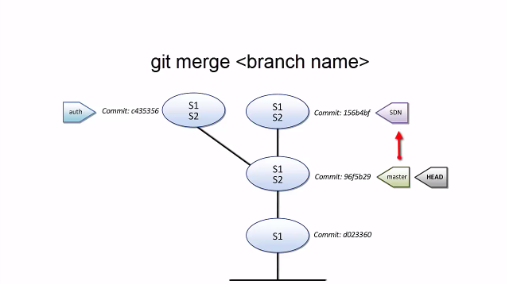
 
  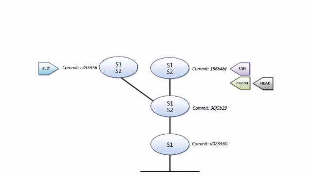

19. En Git, explica cómo funciona la fusión (merge) de tipo 3-way.

  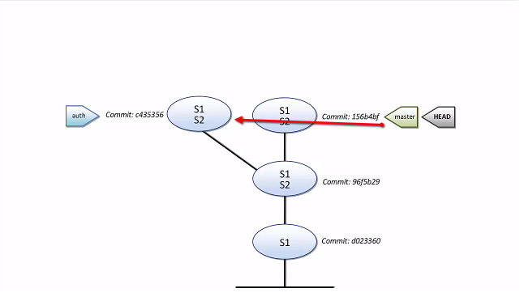
  
  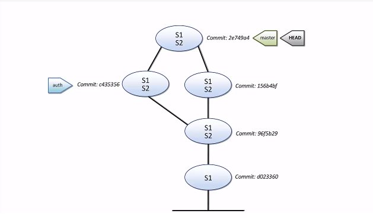

<pre>

</pre>
